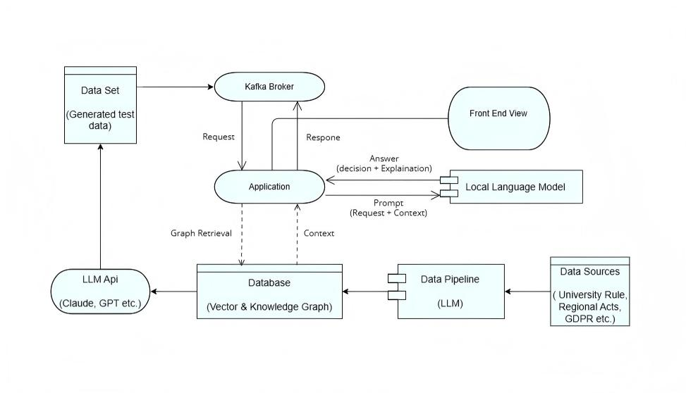

# AI Compliance Gateway

**Event-driven GraphRAG compliance auditing for federated education systems, running a local Small Language Model under edge constraints.**

[Source code on GitHub](https://github.com/ianjunlai/ComplianceGateway) ·
[How to run](https://github.com/ianjunlai/ComplianceGateway/blob/master/README.md) ·
[Reproducibility](https://github.com/ianjunlai/ComplianceGateway/blob/master/REPRODUCIBILITY.md)

---

## Overview

Universities increasingly share personal data across institutional and national
borders, and in Europe this sharing falls under the GDPR. Compliance work is
still mostly manual, which is slow, costly, and inconsistent. This project is an
AI gateway that audits data-sharing requests automatically.

Two constraints shape the design. Requests can contain student data, so the
model that reads them must run locally rather than in the cloud — which means a
Small Language Model (SLM) on limited hardware. And a federation of institutions
sends bursts of requests, while a local SLM answers one at a time, so the system
must absorb load without stalling. The gateway combines Graph-based Retrieval-
Augmented Generation (GraphRAG) for reasoning quality with an event-driven
architecture for stability under load.

## Research questions

1. **RQ1** — To what extent does a GraphRAG framework improve logical reasoning
   in legal compliance auditing compared to Zero-Shot prompting and naive Vector
   RAG on local Small Language Models?
2. **RQ2** — What are the trade-offs regarding context recall, retrieval latency,
   and indexing cost among different GraphRAG paradigms operating under edge
   computing constraints?
3. **RQ3** — To what extent can an Event-Driven Architecture resolve the concurrency
   bottlenecks and cascading failures associated with synchronous, long-running
   SLM inference in a federated university IT ecosystem?

## Contributions

- **An event-driven architecture for edge compliance auditing** that decouples
  high-throughput federated clients from a single, serial local SLM worker
  through a message broker.
- **A controlled comparison of GraphRAG paradigms** (Hybrid Vector-Graph,
  LightRAG, HippoRAG) against Zero-Shot and Vector RAG baselines on the same
  corpus, graph, and local model, for GDPR compliance auditing under edge
  constraints.
- **A privacy-preserving design and a reproducible evaluation method**: a cloud
  model is used offline on public legal text, while every request containing
  personal data is answered locally; the evaluation uses a synthetic dataset
  whose ground truth is fixed by construction.

## Architecture

The system has four layers: a client and load-simulation layer, an event-driven
gateway (Spring Boot and Apache Kafka), an AI inference and retrieval layer
(the GraphRAG pipeline and a local SLM), and a persistence layer (Neo4j, holding
both the knowledge graph and the vector indexes).

## How each research question is addressed

| Research question | Implementation | Experiment | Evidence |
|---|---|---|---|
| RQ1 — reasoning quality | GraphRAG pipeline with constrained decoding on a local SLM | E1: five strategies, single request | accuracy, false-approval rate, abstention rate, faithfulness |
| RQ2 — retrieval trade-offs | three paradigms on one shared graph and index | E2: four retrieval strategies, single request | Recall@5/10, retrieval latency, indexing cost |
| RQ3 — systemic resilience | event-driven gateway vs two synchronous baselines | E3: three integration modes, 1–100 concurrent clients | latency percentiles, throughput, error rate, backlog recovery time |

## Technology

Java 21 and Spring Boot for the gateway; Python for the inference service;
Apache Kafka for the event backbone; Neo4j for the graph and vector store;
Ollama running a quantized Llama-3.1-8B for local inference; Apache JMeter for
load testing.

## Demonstration

_Screenshots and a short demo video will be added once the experimental run is
complete._

---

_MSc dissertation project. See the [repository](https://github.com/ianjunlai/ComplianceGateway) for source code and full documentation._
