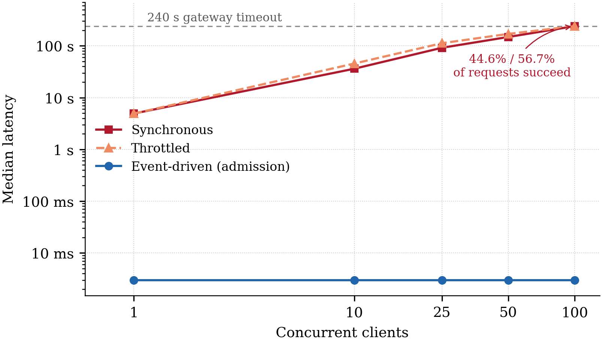

# AI Compliance Gateway

**Event-driven GraphRAG compliance auditing for federated education systems,
running a small language model on the institution's own hardware.**

[Source code on GitHub](https://github.com/ianjunlai/ComplianceGateway) ·
[How to run](https://github.com/ianjunlai/ComplianceGateway/blob/master/README.md) ·
[Reproducibility](https://github.com/ianjunlai/ComplianceGateway/blob/master/REPRODUCIBILITY.md)

---

## Overview

Universities that exchange student data across borders must satisfy three layers
of law at once: the GDPR, the national act of the state where the institution
sits, and the institution's own policy. Checking every transfer by hand does not
scale.

Two constraints shape the design. The requests contain personal data, so the
model that reads them cannot be sent to a third-party API and must run on
institutional hardware — which means a small language model on one GPU. And a
federation sends bursts of requests while that model answers one at a time, so
the gateway has to absorb load without failing its clients.

## Research questions

1. **RQ1** — In compliance auditing for federated education systems, do GraphRAG
   paradigms retrieve the governing provisions more effectively than dense
   vector RAG?
2. **RQ2** — To what extent do dense and graph-based forms of
   retrieval-augmented generation improve the compliance decisions of a local
   small language model, relative to zero-shot prompting and to each other?
3. **RQ3** — To what extent can an event-driven architecture resolve the
   concurrency bottleneck and cascading failures of synchronous, long-running
   SLM inference in a federated university IT ecosystem?

## What was built

A three-tier legal corpus of **959 provisions** — the GDPR, the UK, Irish and
German data protection acts, and four university policies — with **1,414
citation edges** extracted from the text of the legislation itself, so the
relationship between the tiers is explicit rather than implied.

Five retrieval conditions run over one shared graph and index: zero-shot, dense
vector RAG, and Hybrid, LightRAG and HippoRAG reproducing three published
GraphRAG paradigms. Two mechanisms apply to all of them alike, making them
platform properties rather than experimental variables: **jurisdiction scoping**
restricts candidates to the law that actually binds the requesting institution,
and **citation attachment** inserts the provisions a retrieved clause cites
instead of making them compete on similarity.

Evaluation uses 96 generated audit requests in three strata — cross-tier,
single-tier and unanswerable — with the gold answer fixed to the seed provision
by construction.

## Architecture

Four layers: a client and load-simulation layer, an event-driven gateway
(Spring Boot and Apache Kafka), an inference and retrieval layer (the GraphRAG
pipeline and a local SLM), and persistence (Neo4j, holding both the knowledge
graph and the vector indexes).

## Findings

**No graph paradigm improved on dense retrieval.** Hybrid matched a plain chunk
index at two and five clauses and fell behind at ten, while taking twice as
long; LightRAG and HippoRAG scored lower at every depth. All three rest on an
extraction pass costing 1.15 million tokens that a chunk index does not need.
Running the same code on 2WikiMultihopQA confirmed the implementations work and
showed no graph advantage there either.

| Strategy | R@2 | R@5 | R@10 | Retrieval p50 |
|---|---|---|---|---|
| Vector RAG | 0.311 | 0.446 | 0.608 | 108 ms |
| Hybrid | 0.311 | 0.446 | 0.581 | 233 ms |
| LightRAG | 0.270 | 0.351 | 0.432 | 256 ms |
| HippoRAG | 0.095 | 0.108 | 0.135 | 75 ms |

**Retrieval helps, but conditionally.** Averaged over the question set it lifts
decision accuracy from 0.656 to 0.750, which looks unremarkable. Split by
whether retrieval actually delivered the governing provision, the picture
changes: accuracy is 0.79–0.90 where it did, and falls to the zero-shot level
where it did not. The best strategy managed that on 58 per cent of questions, so
**recall, not reasoning, is what limits the system** — and a better language
model would not move the second column.

| Strategy | Gold in context | Accuracy when in | Accuracy when out |
|---|---|---|---|
| Vector RAG | 0.581 | 0.837 | 0.613 |
| Hybrid | 0.541 | 0.900 | 0.559 |
| LightRAG | 0.459 | 0.794 | 0.625 |
| HippoRAG | 0.149 | 0.818 | 0.508 |
| Zero-shot | — | — | 0.649 |

Retrieval did **not** lower the false-approval rate. The extra correct answers
came partly from abstaining less often, and a model that commits more often
commits to wrong approvals as well as to right refusals — the wrong trade for a
compliance gateway, where the two errors do not cost the same.

**Event-driven coupling changes the failure mode, not the throughput.** All
three integration modes completed the same number of audits, because all three
wait on the same serial GPU. They differ under overload: at one hundred
concurrent clients the synchronous gateway timed out on 55.4 per cent of
requests and the throttled variant shed 43.3 per cent, while the event-driven
gateway admitted every request in 3 ms and lost none.

## Why graph retrieval did not help here

The entity layer has almost no selectivity on this corpus. One hop from five
entry clauses admits **99.1 per cent** of the compliance corpus against 19.3 per
cent of 2WikiMultihopQA — a traversal that admits everything has selected
nothing, and the similarity ranking that follows does the entire job.

The cause is measurable: 47 entities, one per cent of the total, account for
93.5 per cent of the clause pairs that share an entity, and *personal data*
alone appears in half the corpus. Meanwhile 69 per cent of entities appear in a
single clause and connect nothing. That is not a defect in the extraction —
these are the terms the legislation is about — but a property shared by half a
corpus carries no information about which half answers a given request.

The one structure that did help was not inferred by a model at all: the
citations the drafters wrote between provisions, which raised the share of
questions reaching the model with their governing provision by 13.5 points.

## Contributions

- **A three-tier compliance corpus with resolved citation edges**, making the
  relationship between EU, national and institutional rules explicit, together
  with the extraction that produces them.
- **A conditional analysis of retrieval** that separates the size of retrieval's
  effect from how often it fires, showing that an unremarkable average can hide
  a large effect with a low hit rate.
- **A measured comparison of event-driven coupling against two synchronous
  variants under overload**, locating its benefit in the failure mode rather
  than in throughput.

## Technology

Java 21 and Spring Boot for the gateway; Python for the inference service;
Apache Kafka for the event backbone; Neo4j for the graph and vector store;
Ollama running a quantized Qwen2.5-14B for local inference; Apache JMeter for
load testing.

---

_MSc dissertation project, University of Limerick. See the
[repository](https://github.com/ianjunlai/ComplianceGateway) for source code and
full documentation._
